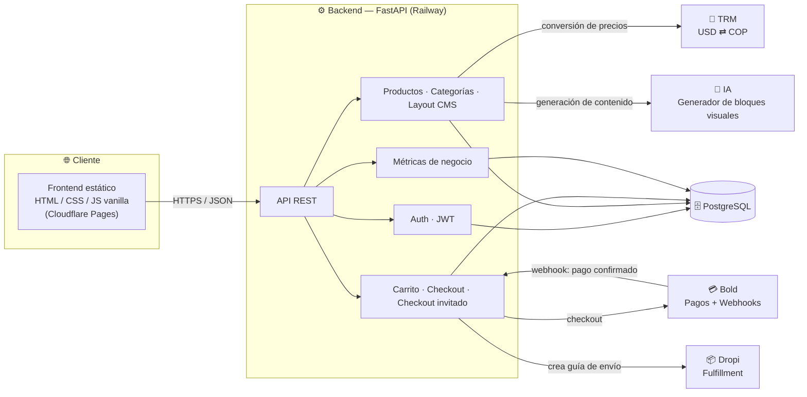

<div align="center">

# 🛍️ Velonox Store

**Plataforma de e-commerce full-stack construida con FastAPI, PostgreSQL y JavaScript vanilla**

Autenticación · Catálogo · Carrito · Checkout (registrado e invitado) · Pagos · Panel administrativo · CMS visual · Métricas de negocio

[](https://www.python.org/)
[](https://fastapi.tiangolo.com/)
[](https://www.postgresql.org/)
[](https://www.sqlalchemy.org/)
[](https://alembic.sqlalchemy.org/)
[](#)
[](https://railway.app/)
[](https://pages.cloudflare.com/)
[](#)

</div>

---

## 📌 Tabla de contenidos

- [Sobre el proyecto](#-sobre-el-proyecto)
- [Estado actual](#-estado-actual)
- [Arquitectura](#-arquitectura)
- [Características](#-características)
- [Stack técnico](#-stack-técnico)
- [Estructura del proyecto](#-estructura-del-proyecto)
- [Instalación rápida](#-instalación-rápida)
- [Variables de entorno](#-variables-de-entorno)
- [Despliegue](#-despliegue)
- [Roadmap](#-roadmap)

---

## 🧭 Sobre el proyecto

**Velonox Store** es una tienda online construida desde cero con un enfoque comercial completo: no es solo un catálogo con carrito, sino una plataforma con panel administrativo, edición visual del layout, checkout invitado, integración con pasarelas de pago y fulfillment, y un sistema de moneda dinámico USD/COP.

El backend expone una API REST con **FastAPI** sobre **PostgreSQL** (SQLAlchemy 2.x, patrón síncrono), y el frontend es **HTML, CSS y JavaScript vanilla**, sin frameworks — priorizando control total y rendimiento sobre el "boilerplate" de un SPA.

## 🚦 Estado actual

El proyecto cuenta con una base funcional sólida y varios módulos operativos:

| Módulo | Estado |
|---|---|
| Autenticación (JWT) | ✅ Operativo |
| Catálogo, productos y categorías | ✅ Operativo |
| Carrito y checkout (registrado / invitado) | ✅ Operativo |
| Pagos con Bold (webhooks + firma de integridad) | ✅ Operativo |
| Fulfillment con Dropi | ✅ Operativo |
| CMS visual del layout (con historial y restauración) | ✅ Operativo |
| Panel administrativo | ✅ Operativo |
| Métricas de negocio | ✅ Operativo |
| Conversión USD/COP vía TRM | ✅ Operativo |
| Suite de pruebas automatizadas | 🚧 Pendiente |

## 🏗️ Arquitectura



## ✨ Características

<table>
<tr>
<td valign="top" width="50%">

### Frontend

- Home con catálogo destacado y contenido visual administrable
- Detalle de producto con descripción, specs, características y relacionados
- Carrito con actualización de cantidades y eliminación de ítems
- Checkout con dos modalidades: pago anticipado y contraentrega
- Checkout invitado sin registro previo
- Panel administrativo para layout, productos, categorías, marca y métricas
- Páginas institucionales, contacto, políticas, regalos y sets

</td>
<td valign="top" width="50%">

### Backend

- API REST con FastAPI y autenticación JWT
- Gestión de usuarios, productos, categorías, carritos, órdenes y páginas de producto
- Integración con pagos y webhooks de Bold (firma de integridad + confirmación de estados)
- Creación automática de órdenes de envío en Dropi
- CMS de layout con bloques configurables, historial de versiones y restauración
- Endpoints de métricas de negocio, checkout invitado, TRM y ajustes de tienda
- Arquitectura preparada para nuevos servicios y funcionalidades

</td>
</tr>
</table>

## ✨ Novedades recientes

- Integración de autenticación con Google Identity Services en la página de login, con endpoint backend para validar el token de Google y crear o reutilizar la cuenta del usuario.
- Flujo de acceso híbrido que soporta login con email/contraseña y login social, incluyendo la creación automática de carrito para usuarios que ingresan por Google.
- Mejoras en el panel administrativo con previsualización en vivo del layout y soporte para historial y restauración de versiones previas del CMS visual.

## 🧰 Stack técnico

| Categoría | Tecnología |
|---|---|
| **Lenguaje** | Python 3.10+ |
| **Framework backend** | FastAPI + Uvicorn |
| **ORM / Base de datos** | SQLAlchemy 2.x (síncrono) + PostgreSQL |
| **Migraciones** | Alembic |
| **Frontend** | HTML5, CSS3, JavaScript vanilla |
| **Pagos** | Bold |
| **Fulfillment** | Dropi |
| **Contenido generativo** | API de IA para bloques visuales (server-side) |
| **Analítica** | Cloudflare Web Analytics |
| **Infraestructura** | Railway (backend) · Cloudflare Pages (frontend) |

## 📁 Estructura del proyecto

```
.
├── backend/          # Lógica del servidor
│   ├── routes/        # auth, products, categories, cart, payments,
│   │                   # guest_checkout, layout, product_pages, metrics, settings
│   ├── models/         # Modelos SQLAlchemy
│   ├── schemas/         # Esquemas Pydantic
│   ├── services/         # Integraciones (Bold, Dropi, TRM, IA)
│   ├── middleware/         # CORS y seguridad
│   └── alembic/              # Migraciones de base de datos
├── frontend/          # Páginas HTML, estilos y scripts del cliente
├── docs/              # Documentación técnica y de negocio
└── INFORME_PROYECTO.txt  # Documento de seguimiento del proyecto
```

## 🚀 Instalación rápida

```bash
# 1. Crear y activar entorno virtual
python -m venv venv
source venv/bin/activate      # En Windows: venv\Scripts\activate

# 2. Instalar dependencias del backend
pip install -r backend/requirements.txt

# 3. Configurar variables de entorno (ver sección siguiente)
cp .env.example .env

# 4. Ejecutar migraciones
cd backend
alembic upgrade head

# 5. Levantar la API
uvicorn main:app --reload

# 6. Servir el frontend
#    Abrir frontend/index.html o servirlo con un servidor estático local
```

## 🔐 Variables de entorno

| Variable | Propósito |
|---|---|
| `DATABASE_URL` | Cadena de conexión a PostgreSQL |
| `SECRET_KEY` | Firma de tokens JWT |
| `FRONTEND_URL` | Origen permitido para CORS |
| `BOLD_API_KEY` / `BOLD_SECRET_KEY` | Integración de pagos con Bold |
| `DROPI_BASE_URL` / `DROPI_API_KEY` | Integración de fulfillment con Dropi |
| `ANTHROPIC_API_KEY` | Generación de bloques visuales vía IA |
| `SMTP_HOST` / `SMTP_PORT` / `SMTP_USER` / `SMTP_PASSWORD` / `SMTP_FROM` | Envío de correos transaccionales |

> No se incluyen credenciales ni secretos en este repositorio.

## ☁️ Despliegue

- **Backend** → Railway
- **Frontend** → Cloudflare Pages
- **Base de datos** → PostgreSQL gestionada por el entorno de ejecución del backend
- **Seguridad** → CORS y políticas de acceso configuradas explícitamente para permitir solo los orígenes esperados

## 🗺️ Roadmap

- [ ] Mejorar la experiencia del panel administrativo
- [ ] Añadir más validaciones y manejo de errores
- [ ] Ampliar pruebas automatizadas y cobertura
- [ ] Mejorar la documentación técnica y de uso
- [ ] Refinar la experiencia visual y la usabilidad
- [ ] Fortalecer el despliegue, la observabilidad y la infraestructura

---

<div align="center">

Proyecto en desarrollo continuo, evolucionando hacia una plataforma más completa, escalable y lista para producción.

</div>
