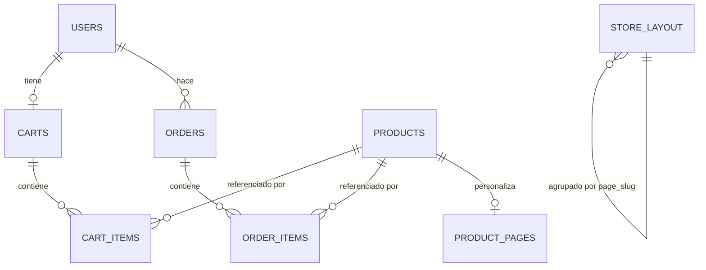

# Modelo de base de datos

Parte de [[proyecto]]. PostgreSQL, ORM SQLAlchemy 2.x síncrono, migraciones con Alembic (`backend/alembic/versions/`). Modelos en `backend/models/`.

## Diagrama de relaciones

`store_settings` y `store_layout` no tienen FK hacia otras tablas — son configuración global/por página de la tienda.

## Tablas

### `users` — `models/user.py`

| Columna | Tipo | Reglas |
|---|---|---|
| `id` | UUID | PK, default `uuid4()` |
| `email` | String | `unique`, `not null`, indexado |
| `hashed_password` | String | `not null` (bcrypt) |
| `full_name` | String | `not null` |
| `is_admin` | Boolean | default `False` — gate de `get_current_admin` |
| `is_active` | Boolean | default `True` — gate de `get_current_user` (403 si es `False`) |
| `created_at` | DateTime (tz) | `server_default now()` |

Relaciones: `orders` (1→N con `Order`), `cart` (1→1 con `Cart`, `uselist=False`).

### `products` — `models/product.py`

| Columna | Tipo | Reglas |
|---|---|---|
| `id` | UUID | PK |
| `name` | String | `not null` |
| `description` | Text | nullable |
| `price` | Float | `not null` |
| `stock` | Integer | `not null`, default `0` |
| `image_url` | String | nullable |
| `is_active` | Boolean | default `True` — **soft delete**: `DELETE /products/{id}` solo pone esto en `False`, nunca borra la fila (ver [[rutas-api]]) |
| `created_at` | DateTime (tz) | `server_default now()` |

Relaciones: `order_items` (1→N), `cart_items` (1→N).

### `carts` — `models/cart.py`

| Columna | Tipo | Reglas |
|---|---|---|
| `id` | UUID | PK |
| `user_id` | UUID | FK → `users.id`, **`unique`** → relación 1→1 con `User` |
| `updated_at` | DateTime (tz) | `server_default now()`, `onupdate now()` |

Un carrito se crea automáticamente en `POST /auth/register` — todo usuario tiene exactamente un carrito desde que se registra.

### `cart_items` — `models/cart.py`

| Columna | Tipo | Reglas |
|---|---|---|
| `id` | UUID | PK |
| `cart_id` | UUID | FK → `carts.id` |
| `product_id` | UUID | FK → `products.id` |
| `quantity` | Integer | `not null`, default `1` |
| `added_at` | DateTime (tz) | `server_default now()` |

`cascade="all, delete-orphan"` en `Cart.items` — borrar un carrito borra sus items.

### `orders` — `models/order.py`

| Columna | Tipo | Reglas |
|---|---|---|
| `id` | UUID | PK |
| `user_id` | UUID | FK → `users.id` |
| `status` | String | `not null`, default `"pending"` — valores usados en código: `pending` / `paid` / `cancelled` (no es un `Enum` de DB, es solo convención de string) |
| `total_amount` | Float | `not null` |
| `stripe_payment_id` | String | nullable — se rellena tras crear la sesión de Stripe Checkout |
| `created_at` | DateTime (tz) | `server_default now()` |

Relaciones: `user`, `items` (1→N con `OrderItem`, `cascade="all, delete-orphan"`).

### `order_items` — `models/order.py`

| Columna | Tipo | Reglas |
|---|---|---|
| `id` | UUID | PK |
| `order_id` | UUID | FK → `orders.id` |
| `product_id` | UUID | FK → `products.id` |
| `quantity` | Integer | `not null` |
| `unit_price` | Float | `not null` |

> [!tip] `unit_price` es una foto del precio, no una referencia viva
> Se copia `product.price` al momento del checkout (`routes/payments.py`). Si el precio del producto cambia después, las órdenes ya creadas conservan el precio original — es intencional, no un bug.

### `store_layout` — `models/layout.py`

| Columna | Tipo | Reglas |
|---|---|---|
| `id` | String | PK — no es UUID típico; puede ser un id fijo (`"block-announcement"`) para bloques por defecto, o un `str(uuid4())` para bloques agregados dinámicamente |
| `block_type` | String | `not null` (ej. `hero_banner`, `product_grid`, `custom_html`, `footer`, etc.) |
| `order_index` | Integer | `not null`, default `0` — posición del bloque dentro de la página |
| `config` | Text | `not null`, default `"{}"` — **JSON serializado como string**, se parsea/serializa a mano en `routes/layout.py` (no hay columna `JSON` nativa) |
| `is_visible` | Boolean | `not null`, default `True` |
| `created_at` / `updated_at` | DateTime (tz) | `server_default now()` |
| `page_slug` | String | ver regla especial abajo |

> [!warning] Columna especial: `page_slug`
> Agregada en la migración `5f49364d06e9_agregar_page_slug_a_store_layout.py` como `nullable=False, server_default='home'` + índice `ix_store_layout_page_slug`. Permite que una misma tabla `store_layout` guarde los bloques de **varias páginas** (`home`, `contacto`, `nosotros`, `politicas`, `terminos`, etc.), filtrando siempre por `page_slug` en las queries de `routes/layout.py`.
>
> El modelo Python (`models/layout.py`) declara la columna como `nullable=True, default="home"` — más laxo que la migración (que la dejó `NOT NULL` con default a nivel de servidor). No es un error activo porque el `server_default` de la DB sigue cubriendo los inserts existentes, pero si se vuelve a tocar esta columna conviene alinear ambas definiciones. Historia completa del incidente relacionado en [[incidente-page-slug-alembic]].

### `store_settings` — `models/settings.py`

| Columna | Tipo | Reglas |
|---|---|---|
| `key` | String | PK |
| `value` | String | nullable |
| `updated_at` | DateTime (tz) | `server_default now()`, `onupdate now()` |

Tabla clave/valor simple para configuración global de la tienda.

### `product_pages` — `models/product_page.py`

| Columna | Tipo | Reglas |
|---|---|---|
| `product_id` | UUID | **PK y FK** → `products.id` — relación 1→1 opcional con `Product` (solo existe fila si el producto tiene página personalizada) |
| `use_custom_layout` | Boolean | `not null`, default `False` |
| `custom_blocks` | Text | nullable — JSON serializado |
| `description` | Text | nullable |
| `specs` | Text | nullable — JSON serializado |
| `features` | Text | nullable — JSON serializado |
| `variants` | Text | nullable — JSON serializado |
| `updated_at` | DateTime (tz) | `server_default now()`, `onupdate now()` |

> [!bug] Sin migración propia
> A diferencia de las demás tablas, `product_pages` **no tiene ninguna migración de Alembic que la cree** (commit `737aba3`, "feat: backend de paginas de producto...", agregó el modelo y las rutas pero ningún archivo en `alembic/versions/`). Si la tabla existe en producción fue creada manualmente o por otra vía fuera de Alembic — no está garantizado que un entorno nuevo (o un restore de DB) la tenga. Antes de depender de este modelo en un entorno nuevo, generar la migración faltante con `alembic revision --autogenerate`.

## `alembic_version`

Tabla que gestiona el propio Alembic (no es un modelo de la app, no aparece en `models/`). Contiene una sola fila con la columna `version_num`, que guarda el id de la última migración aplicada en esa base de datos. Es la pieza central del incidente documentado en [[incidente-page-slug-alembic]]: si las migraciones no se ejecutan en el entorno de despliegue, esta tabla se queda desactualizada respecto al código y el esquema real de la DB no coincide con lo que los modelos esperan.

## Historial de migraciones

1. `ff0162fd9e2e` — crear tablas iniciales: `products`, `users`, `carts`, `orders`, `cart_items`, `order_items`.
2. `302a69224730` — agregar `store_layout` y `store_settings`.
3. `5f49364d06e9` — agregar `page_slug` a `store_layout` (+ índice).
4. *(faltante)* — `product_pages` nunca tuvo migración generada (ver arriba).

## Notas relacionadas

- [[proyecto]]
- [[rutas-api]]
- [[incidente-page-slug-alembic]]
